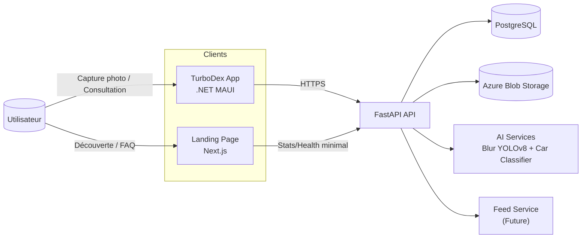

```mermaid
flowchart LR
  user[(Utilisateur)]

  subgraph Clients
    MAUI["TurboDex App\n.NET MAUI"]
    LP["Landing Page\nNext.js"]
  end

  API[FastAPI API]
  AI["AI Services\nBlur YOLOv8 + Car Classifier"]
  DB[(PostgreSQL)]
  BLOB[(Azure Blob Storage)]
  FEED["Feed Service\n(Future)"]

  user -->|Capture photo / Consultation| MAUI
  user -->|Découverte / FAQ| LP
  MAUI -->|HTTPS| API
  LP -->|Stats/Health minimal| API
  API --> DB
  API --> BLOB
  API --> AI
  API --> FEED


```
